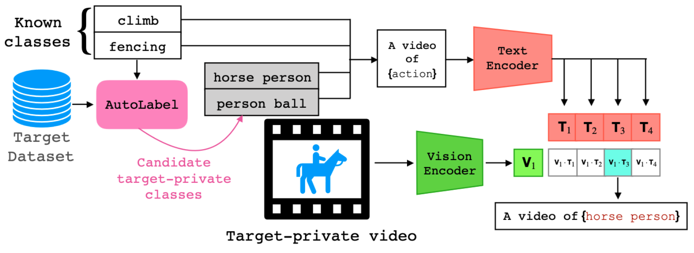

# AutoLabel: CLIP-based framework for Open-set Video Domain Adaptation

This repository contains the official code for the paper [AutoLabel: CLIP-based framework for Open-set Video Domain Adaptation](https://arxiv.org/abs/2304.01110) (CVPR 2023), by Giacomo Zara, Subhankar Roy, Paolo Rota and Elisa Ricci.

The `scripts` folder contains a sample script to run the experiment. It is possible to run for any setting by just changing the `setting` flag to any of the options present in `configs/setting/`. Please note that the paths in the `get_datasets()`method in `data/dataloader.py` can and should be edited according to the current file system. The file `autolabel.yaml` can be used to build the conda environment where to run the experiments (modify the prefix according to your file system).

